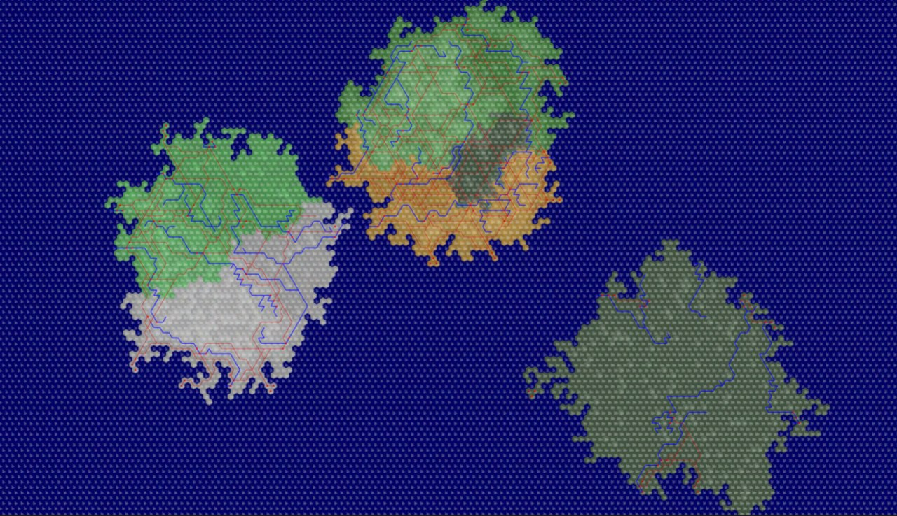
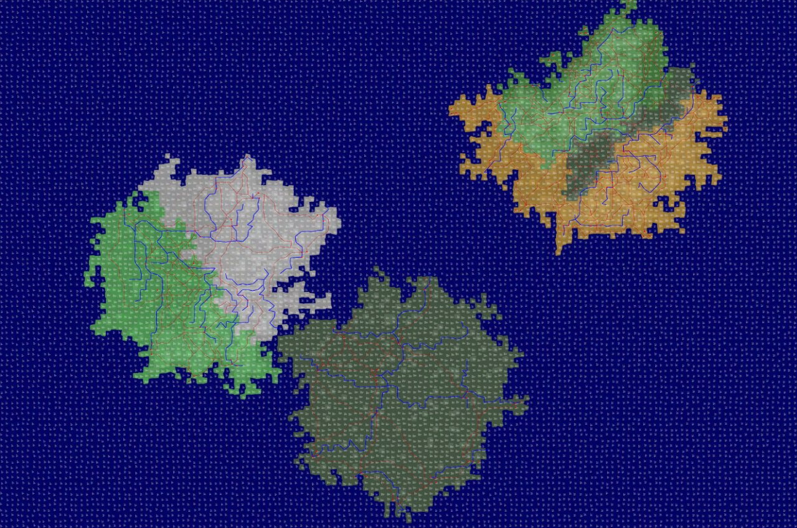

# Tabletop RPG worlds generator system

## Idea

This project is created for those who want to generate an image of a fantasy world from its description.

The tool has concepts of:
* Contients
* Terrains
* Biomes
* Rivers
* Cities
* Roads

The tool allows to define Continents, their relative locations, etc.

The output is a list of images that show the state of the world after each concept is applied sequentally.

## Input format

The Description must be written in `JSON` format.

### Map config

```
"map_config":{
        "world_name": "Alagorn",
        "height": 100,
        "width": 150,
        "size": 100,
        "type": "HEX"
    },
```

`type` : type of the map. Possible options are `HEX` and `VORONOI`
`height` : number of rows in the world
`width` : number of cells in each row 
`size` : average distance in pixels between to cell centers

### Continents

Define continents and their names.

```
"continents":[
        {"name": "Continent1"}, 
        {"name": "Continent2"}, 
        {"name": "Continent3"}
    ],
```

### Continents relative location

```
"continents_relative_location":[
    {
        "first": "Continent1",
        "location": "on north-east of",
        "second": "Continent2"
    },
    {
        "first": "Continent2",
        "location": "on north-west of",
        "second": "Continent3"
    }
],
```

Continent defined in previous step can be set with relative location to each other.

###  Terrains

```
"terrains":[
    {
        "name": "Terrain_1_1",
        "type": "mountain",
        "continent": "Continent1"
    },
    {
        "name": "Terrain_1_2",
        "type": "plain",
        "continent": "Continent1"
    },
    {
        "name": "Terrain_1_3",
        "type": "hill",
        "continent": "Continent1"
    },
    {
        "name": "Terrain_2_1",
        "type": "plain",
        "continent": "Continent2"
    },
    {
        "name": "Terrain_2_2",
        "type": "hill",
        "continent": "Continent2"
    },
    {
        "name": "Terrain_3_1",
        "type": "plain",
        "continent": "Continent3"
    }
],
```

Each terrain must contain 
* `name`
* `type` that can be `plain`, `hill`, or `mountain`
* `continent` on which the terrain is located

### Terrains relative location

```
"terrains_relative_location":[
    {
        "continent": "Continent1",
        "first": "Terrain_1_1",
        "location": "on north of",
        "second": "Terrain_1_2"
    },
    {
        "continent": "Continent1",
        "first": "Terrain_1_2",
        "location": "on north of",
        "second": "Terrain_1_3"
    }
],
```

Terrains defined in previous step can be set with relative location to each other. Also, both terrains compared must lie on the same continent.

### Biomes

```
"biomes":[
    {
        "name": "Biom_1_1",
        "type": "forest",
        "continent": "Continent1"
    },
    {
        "name": "Biom_1_2",
        "type": "swamp",
        "continent": "Continent1"
    },
    {
        "name": "Biom_1_3",
        "type": "desert",
        "continent": "Continent1"
    },
    {
        "name": "Biom_2_1",
        "type": "field",
        "continent": "Continent2"
    },
    {
        "name": "Biom_2_2",
        "type": "tundra",
        "continent": "Continent2"
    },
    {
        "name": "Biom_3_1",
        "type": "swamp",
        "continent": "Continent3"
    }
],
```

Each biom must contain 
* `name`
* `type` that can be one of those defined in `./inputs/biomes`
* `continent` on which the biom is located

New biomes can be added to the `./inputs/biomes` folder by user, and used in worlds. For that, check other files in the mentioned directory.

### Biomes relative location

```
"biomes_relative_location": [
    {
        "continent": "Continent1",
        "first": "Biom_1_1",
        "location": "on north of",
        "second": "Biom_1_2"
    },
    {
        "continent": "Continent1",
        "first": "Biom_1_2",
        "location": "on east of",
        "second": "Biom_1_3"
    }
]
```

Biomes defined in previous step can be set with relative location to each other. Also, both biomes compared must lie on the same continent.

### River cluster

```
"river_clusters":[
    {
        "count": 20,
        "continent": "Continent1"
    },
    {
        "count": 15,
        "continent": "Continent2"
    },
    {
        "count": 10,
        "continent": "Continent3"
    }
],
```

This section describes how much rivers should be allocated on each continent.

### City clusters

```
"city_clusters":[
    {
        "count": 30,
        "continent": "Continent1"
    },
    {
        "count": 20,
        "continent": "Continent2"
    },
    {
        "count": 10,
        "continent": "Continent3"
    }
],
```

This section describes how much cities should be allocated on each continent.

## Example outputs

**Hexagonal world**



**Voronoi world**



